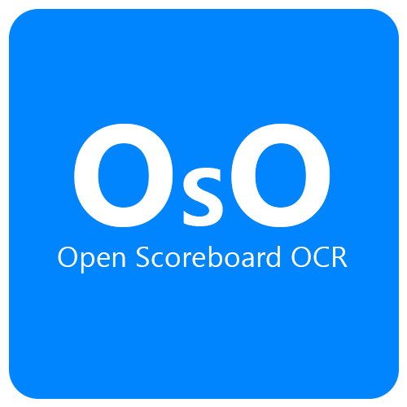
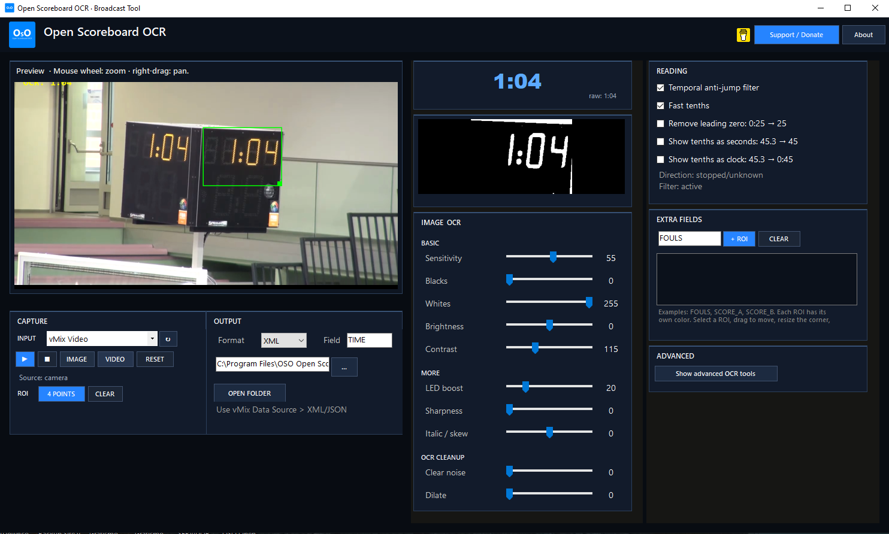

<p align="center">
  
</p>

<h1 align="center">OSO – Open Scoreboard OCR</h1>

<p align="center">
  A lightweight Windows OCR tool for extracting scoreboard clocks, scores and other numeric data for live broadcast workflows.
</p>

<p align="center">
  
  
  
  
</p>

<p align="center">
  <a href="https://github.com/openscoreboardocr/OSO-Open-Scoreboard-OCR/releases/latest">
    
  </a>
  &nbsp;
  <a href="https://buymeacoffee.com/andremgomes">
    
  </a>
</p>

<p align="center">
  
</p>

---

## About

**OSO – Open Scoreboard OCR** is an independent Windows application designed to read information from physical scoreboards using OCR and make that data available for live broadcast workflows.

The project started as a personal tool for smaller productions where dedicated scoreboard data systems are not always available or affordable.

OSO is currently in **early beta** and is still being actively developed.

The main goal is to provide a simple and accessible way to extract scoreboard information and send it to graphics or broadcast systems without requiring expensive dedicated hardware.

---

## Features

- OCR reading of scoreboard clocks
- Support for `MM:SS` clock formats
- Support for tenths of a second
- Temporal anti-jump filtering
- Perspective correction
- Adjustable ROI selection
- Multiple OCR image-processing controls
- Extra ROIs for additional numeric fields
- Score reading
- Fouls reading
- Custom numeric fields
- XML output
- JSON output
- vMix-friendly Data Source workflow
- OBS-friendly external data workflow
- Camera / capture device input
- Image input
- Video input for testing
- Custom-trained OCR model for scoreboard digits
- Windows x64 installer

---

## Broadcast Workflow

```text
Physical Scoreboard
        ↓
Camera / Capture Device
        ↓
OSO – Open Scoreboard OCR
        ↓
XML / JSON
        ↓
vMix / Graphics / Broadcast Workflow
